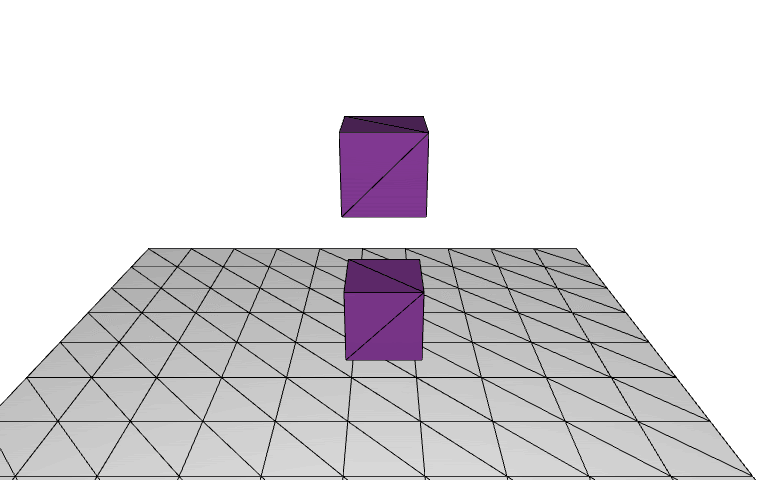
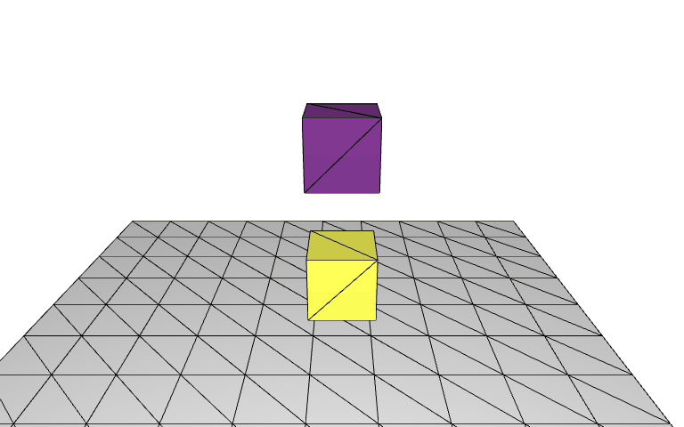
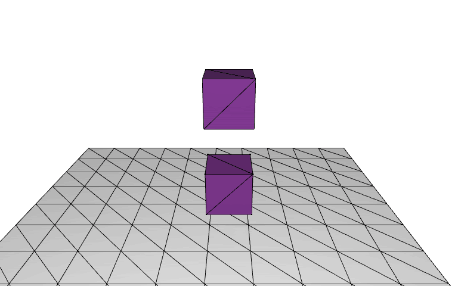
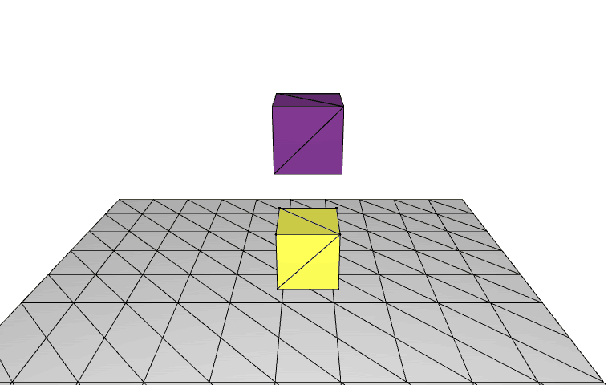
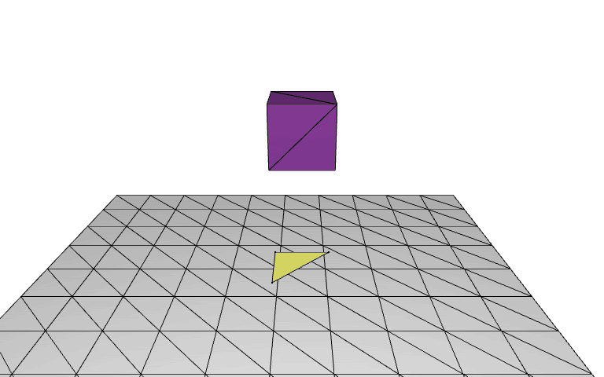
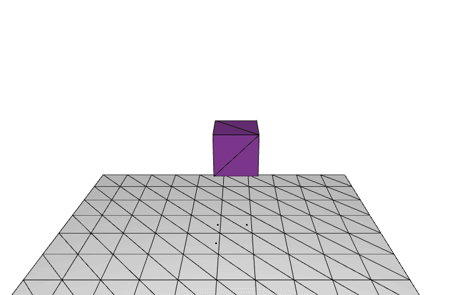
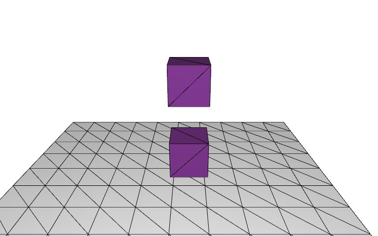
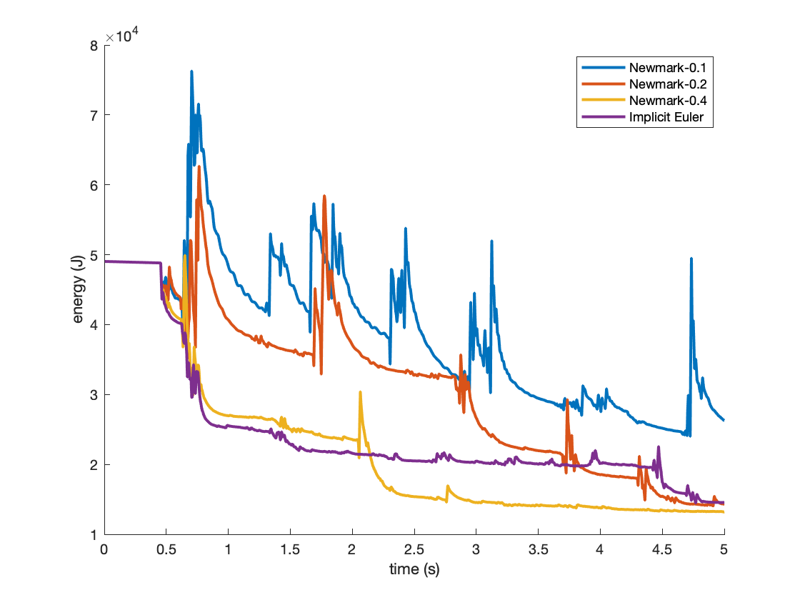

# IPC Quick Start Guide

## Setup
After compiling IPC, we need to create 3 folders named `1`, `8`, `12` in `input/` to be able to use `batch.py` to conveniently run IPC with multi-threaded direct linear solvers (CHOLMOD).

## Hello World
If we copy `input/tutorialExamples/2cubesFall.txt` to any one of the folders `input/1`, `input/8`, or `input/12` depending on how many threads we want to use for each linear solver, and then in the root directory run

`python batch.py`

We will obtain the “Hello World” simulation results of IPC with 2 cubes falling together to the ground!



Let’s take a look at the config file `input/tutorialExamples/2cubesFall.txt`:
<pre>
shapes input 2
input/tetMeshes/cube.msh 0 3 0  0 0 0  1 1 1
input/tetMeshes/cube.msh 0 1 0  0 0 0  1 1 1

selfFric 0.1

ground 0.1 0
</pre>
Very simple:
* The `shapes` block specifies 2 cubes, placed one upon each other (first 3 numbers are translation x, y, z) without rotation (middle 3 numbers, Euler angle in degree) or scalings (last 3 numbers) to the original geometry. Here we provide a lot of input shapes (tetrahedral meshes in .msh) in `input/tetMeshes/`. We will talk about how to use other shapes later.
* Then we use `selfFric` to set friction coefficient between objects to `0.1`, if we don’t specify it by default it is simply `0`. (IPC sees inter-object contact as equivalent to self-contact.)
* Finally, we add a ground plane (halfspace) also with friction coefficient `0.1` at `y=0`. Here the plane is infinitely large and analytical, the meshed plane we saw is just for easy rendering.
* <em>Note that the order of the blocks in the script file does not matter.</em>

## Physical Materials and Time Steppers
Now let’s make some changes to the hello world script to make the simulation more interesting!

### Stiffer Material
By default, IPC uses material parameters at
* Density = 1000 kg/m^3
* Young’s Modulus = 10^5 Pa
* Poisson’s Ratio = 0.4

To change these parameters for all objects in the scene, we can add another text block in the script file `input/tutorialExamples/2cubesFall_stiffer.txt`:
```diff
shapes input 2
input/tetMeshes/cube.msh 0 3 0  0 0 0  1 1 1
input/tetMeshes/cube.msh 0 1 0  0 0 0  1 1 1

+ density 1000
+ stiffness 1e6 0.4

selfFric 0.1

ground 0.1 0
```
The added texts here are added to set the Young’s Modulus 10x larger than default while keeping density and Poisson’s ratio the same as the default. Let’s see what we get:


Yes! The boxes are stiffer now!

### Multiple Materials
We can also set different materials for different objects: (`input/tutorialExamples/2cubesFall_heavyTop.txt`)
```diff
shapes input 2
- input/tetMeshes/cube.msh 0 3 0  0 0 0  1 1 1
+ input/tetMeshes/cube.msh 0 3 0  0 0 0  1 1 1 material 3000 1e8 0.4
input/tetMeshes/cube.msh 0 1 0  0 0 0  1 1 1

selfFric 0.1

ground 0.1 0
```
Adding the `material` keyword together with density (kg/m^3), Young’s modulus (Pa), and Poisson’s ratio to the end of an input shape line can set material parameters for this shape. If not specified, the shape will just be the global material. Here we set the top box 3x heavier and 1000x stiffer!



As we see the top box is nearly rigid now and the bottom box deforms more! (Here we rendered softer material with a lighter color.) Even with this super stiff material IPC stays robust and accurate.

### Simulation Time and Time Step Size
By default IPC simulates a scene for 5 seconds with a time step size of 0.025s, generating 200 frames.

#### Smaller Time Step Sizes
To get more energetic animation we can use smaller time step sizes to reduce the numerical damping of implicit Euler time integration: (`input/tutorialExamples/2cubesFall_smallerDt.txt`)
```diff
shapes input 2
input/tetMeshes/cube.msh 0 3 0  0 0 0  1 1 1
input/tetMeshes/cube.msh 0 1 0  0 0 0  1 1 1

selfFric 0.1

ground 0.1 0

+ time 5 0.005
```
The `time` command here set the simulation time to `5s` and time step size to `0.005s`, which results in a more energetic animation:


#### Larger Time Step Sizes (Nearly Quasi-Static)
One of the exciting features of IPC is that it is robust enough to support even larger time step sizes (nearly quasi-static solves)! For example, we can simulate our hello world example with dt=1s: (`input/tutorialExamples/2cubesFall_largerDt.txt`)
```diff
shapes input 2
input/tetMeshes/cube.msh 0 3 0  0 0 0  1 1 1
input/tetMeshes/cube.msh 0 1 0  0 0 0  1 1 1

selfFric 0.1

ground 0.1 0

+ time 5 1
```


The animation now is composed of only 5 frames, 1 for each second. As we see numerical damping is so large that the cubes are barely bouncing.

### Full Script
To recap, here we also provide the full script of the default hello world example that explicitly lists all default settings as a reference: (`input/tutorialExamples/2cubesFall_full.txt`)
<pre>
shapes input 2
input/tetMeshes/cube.msh 0 3 0  0 0 0  1 1 1  material 1000 1e5 0.4
input/tetMeshes/cube.msh 0 1 0  0 0 0  1 1 1  material 1000 1e5 0.4

density 1000
stiffness 1e5 0.4

selfFric 0.1

ground 0.1 0

time 5 0.025
</pre>

## Initial Velocity
To set nonzero initial velocities for objects, simply append the initial linear and angular (Euler angles by degree) velocities to the end of each shape line just like how we assign object materials individually.

### Initial Angular Velocity
Specifically, following the keyword `initVel`, we use 6 floating point numbers to set the linear and angular initial velocity of the object. This script sets the upper box to be initially rotating `90` deg/s along y axis: (`input/tutorialExamples/initVel/2cubesFall_initRot.txt`)
```diff
shapes input 2
- input/tetMeshes/cube.msh 0 3 0  0 0 0  1 1 1
+ input/tetMeshes/cube.msh 0 3 0  0 0 0  1 1 1  initVel 0 0 0  0 90 0
input/tetMeshes/cube.msh 0 1 0  0 0 0  1 1 1

selfFric 0.1

ground 0.1 0
```


### Initial Linear Velocity
This script sets the initial linear velocity of the upper box to be `-20` m/s along y axis: (`input/tutorialExamples/initVel/2cubesFall_initVel.txt`)
```diff
shapes input 2
- input/tetMeshes/cube.msh 0 3 0  0 0 0  1 1 1
+ input/tetMeshes/cube.msh 0 3 0  0 0 0  1 1 1  initVel 0 -20 0  0 0 0
input/tetMeshes/cube.msh 0 1 0  0 0 0  1 1 1

selfFric 0.1

ground 0.1 0
```


Even for this high-speed impact scene, IPC stays robust and accurate without numerical instabilities or explosion.

## Kinematic Collision Objects
In many simulations we want to script the motion of certain objects, this can be done by simply adding prescribed linear or angular (Euler angles by degree) velocities to the end of each shape line just like how we assign object materials individually.

### Translation
`input/tutorialExamples/MCO/2cubesFall_translateCO.txt`:
```diff
shapes input 2
input/tetMeshes/cube.msh 0 3 0  0 0 0  1 1 1
- input/tetMeshes/cube.msh 0 1 0  0 0 0  1 1 1
+ input/tetMeshes/cube.msh 0 1 0  0 0 0  1 1 1  linearVelocity 1 1 1

selfFric 0.1

ground 0.1 0
```

The above script set the bottom box to be kinematically moved by a velocity of (1, 1, 1) m/s:



### Rotation
`input/tutorialExamples/MCO/2cubesFall_rotateCO.txt`:
```diff
shapes input 2
input/tetMeshes/cube.msh 0 3 0  0 0 0  1 1 1
- input/tetMeshes/cube.msh 0 1 0  0 0 0  1 1 1
+ input/tetMeshes/cube.msh 0 1 0  0 0 0  1 1 1  angularVelocity 10 90 0

selfFric 0.1

ground 0.1 0
```
The above script set the bottom box to be kinematically rotated (around its current axis-aligned bounding box center) by an angular velocity of (10, 90, 0) degree/s in Euler’s angle representation:


### Codimensional
Since IPC contact handling is based on distances, it directly supports codimensional (surfaces, edges, points) kinematic collision objects!

<em>But note that currently, IPC does not include codimensional objects simulation like discrete shells or rods.</em>

#### Closed Surface
If we script the motion of an object, then for a closed surface the interior tessellation is unnecessary, and we can directly use a surface mesh (.obj file)! 
`input/tutorialExamples/MCO/2cubesFall_rotateCO_closedSurface.txt`:
```diff
shapes input 2
input/tetMeshes/cube.msh 0 3 0  0 0 0  1 1 1
- input/triMeshes/cube.msh 0 1 0  0 0 0  1 1 1 angularVelocity 10 90 0
+ input/triMeshes/cube.obj 0 1 0  0 0 0  1 1 1 angularVelocity 10 90 0

selfFric 0.1

ground 0.1 0
```
It gives the same result as scripting volumetric objects but usually can be more efficient: (Here we rendered non-volumetric objects with a lighter color.)



#### Open Surface
`input/tutorialExamples/MCO/2cubesFall_rotateCO_triangle.txt`:
```diff
shapes input 2
input/tetMeshes/cube.msh 0 3 0  0 0 0  1 1 1
- input/triMeshes/cube.msh 0 1 0  0 0 0  1 1 1 angularVelocity 10 90 0
+ input/triMeshes/triangle.obj 0 1 0  0 0 0  1 1 1 angularVelocity 10 90 0

selfFric 0.1

ground 0.1 0
```
This script uses a single triangle at the bottom:



#### Edges
This script uses the same single triangle but only with its edges. Here we also scale the triangle 2x larger to let the box fall through. `input/tutorialExamples/MCO/2cubesFall_rotateCO_edges.txt`:
```diff
shapes input 2
input/tetMeshes/cube.msh 0 3 0  0 0 0  1 1 1
- input/triMeshes/triangle.obj 0 1 0  0 0 0  1 1 1 angularVelocity 10 90 0
+ input/triMeshes/triangle.seg 0 1 0  0 0 0  2 2 2 angularVelocity 10 90 0

selfFric 0.1

ground 0.1 0

zoom 0.3
```


The .seg file specifies the edges, but here we are applying a trick: there is actually no `triangle.seg` file under `input/triMeshes/`, but once `input/triMeshes/triangle.obj` exists, IPC will automatically load the obj and uses only its edges for contact.

Nevertheless, to input edges that are not from a surface mesh, we here provide a .seg file reference of a single segment: (`input/segMeshes/edge.seg`)
<pre>
v 0 0 0
v 1 0 0
s 1 2
</pre>
Here v specifies vertex coordinates, s specifies edges that are connecting 2 vertices, very similar to .obj format!

#### Points
Even more crazy this script uses the same single triangle but only with its points. Here we also scale the point cloud 0.8x smaller to let the box hit the points. `input/tutorialExamples/MCO/2cubesFall_rotateCO_points.txt`:
```diff
shapes input 2
input/tetMeshes/cube.msh 0 3 0  0 0 0  1 1 1
- input/triMeshes/triangle.obj 0 1 0  0 0 0  1 1 1 angularVelocity 10 90 0
+ input/triMeshes/triangle.pt 0 1 0  0 0 0  0.8 0.8 0.8 angularVelocity 10 90 0

selfFric 0.1

ground 0.1 0

zoom 0.3
```



The .pt file specifies the points, and here we are applying the same trick: there is actually no `triangle.pt` file under `input/triMeshes/`, but once `input/triMeshes/triangle.obj` exists, IPC will automatically load the obj and uses only its points for contact.

To input points that are not from a surface mesh, the .pt file can be created with only vertex coordinates lines of the .obj file.

## Boundary Conditions

### Dirichlet
For a simulated volumetric object, sometimes we script the motion of part of its vertices as Dirichlet boundary conditions. This can be simply realized by adding `DBC` commands to the end of each shape line just like how we assign object materials individually: (`input/tutorialExamples/BC/2cubesFall_DBC.txt`)
```diff
shapes input 2
input/tetMeshes/cube.msh 0 3 0  0 0 0  1 1 1
- input/tetMeshes/cube.msh 0 1 0  0 0 0  1 1 1
+ input/tetMeshes/cube.msh 0 1 0  0 0 0  1 1 1  DBC -0.1 -0.1 -0.1  0.1 1.1 0.1  -0.2 0 -0.2  0 0 0  DBC 0.9 -0.1 0.9  1.1 1.1 1.1  0.2 0 0.2  0 0 0

selfFric 0.1

ground 0.1 0
```
One can append as many `DBC` commands as needed after each shape line. Each `DBC` command is followed by 12 floating-point numbers, the first 6 form the relative bounding box coordinates of the bottom-left and top-right corner of the selection cuboid, and the last 6 forms the linear velocity followed by angular velocity represented as Euler angles in degree.
For example, the above script first selects all vertices in the left-back and move them with (`-0.2`, `0`, `-0.2`) m/s, and then it selects the right-front vertices and moves them with (`0.2`, `0`, `0.2`) m/s:


As we see IPC is robust even when there is large deformation.

What’s different here from setting kinematic collision objects is that the unselected vertices are still degree-of-freedoms which are simulated. If one selects all vertices of an object by putting the selection box at e.g. (-0.1, -0.1, -0.1) - (1.1, 1.1, 1.1), and sets them with Dirichlet boundary conditions, it will be essentially identical to a kinematic collision object in IPC.

### Neumann
We can also add extra constant body forces to part of the vertices of simulated volumetric objects in addition to gravity. This can be similarly realized by adding `NBC` commands to the end of each shape line just like how we did for Dirichlet boundary conditions above: (`input/tutorialExamples/BC/2cubesFall_NBC.txt`)
```diff
shapes input 2
input/tetMeshes/cube.msh 0 3 0  0 0 0  1 1 1
- input/tetMeshes/cube.msh 0 1 0  0 0 0  1 1 1
+ input/tetMeshes/cube.msh 0 1 0  0 0 0  1 1 1  NBC -0.1 -0.1 -0.1  0.1 1.1 0.1  -50 0 -50  NBC 0.9 -0.1 0.9  1.1 1.1 1.1  50 0 50

selfFric 0.1

ground 0.1 0
```
One can append as many `NBC` commands as needed after each shape line. Each `NBC` command is followed by 9 floating-point numbers, the first 6 form the relative bounding box coordinates of the bottom-left and top-right corner of the selection cuboid, and the last 3 forms the linear acceleration in the unit of m/s^2. Here torque is not supported as it is node position dependent and so more complicated, which is also not usually used as Neumann bounary conditions.
Similar to the configuration in our Dirichlet example, the above script first selects all vertices in the left-back and drag them with an extra acceleration of (`-50`, `0`, `-50`) m/s^2, and then it selects the right-front vertices and moves them with an extra acceleration of (`50`, `0`, `50`) m/s^2:



Unlike Dirichlet boundary conditions, here Neumann boundary condition does not directly affect the vertical motion of the object, and it elongates the object only to a static state but not further.

## Advanced Settings

### Input Mesh Sequence
The way of setting kinematic collision objects provided by IPC script only supports simple translations or rotations. To support more complex kinematic collision objects, IPC allows using input mesh file sequences.

For example, we can specify a folder path to the kinematic collision objects: (`input/tutorialExamples/advanced/2cubesFall_rotateCO_meshSeq.txt`)
```diff
shapes input 2
input/tetMeshes/cube.msh 0 3 0  0 0 0  1 1 1
- input/triMeshes/triangle.seg 0 1 0  0 0 0  2 2 2  angularVelocity 10 90 0
+ input/triMeshes/triangle.seg 0 1 0  0 0 0  2 2 2  meshSeq input/segMeshes/sequence

selfFric 0.1

ground 0.1 0

zoom 0.3
```
In the specified folder `input/segMeshes/sequence` we provide the mesh files (here .seg, or .obj that can be automatically transformed by IPC) of the triangle wire in each frame as n.seg or n.obj, where n is the number of the frame. Here we simply use the mesh output of our triangle wire kinematic collision object simulation, and we are able to reproduce that simulation by loading the triangle wire mesh sequence files! Note that the input sequence must maintain the correct vertex correspondence to the one specified in the `shapes` block.

### Attaching Configuration Initialization
To initialize attaching configuration, IPC requires a tiny positive gap because IPC does not support the exact attaching configuration (0 distance).

The following script set the upper box in the hello world example right above the lower one: (`input/tutorialExamples/advanced/2cubesFall_attach.txt`)
```diff
shapes input 2
- input/tetMeshes/cube.msh 0 3 0  0 0 0  1 1 1
+ input/tetMeshes/cube.msh 0 2.001 0  0 0 0  1 1 1
input/tetMeshes/cube.msh 0 1 0  0 0 0  1 1 1

selfFric 0.1

ground 0.1 0
```


The initial gap is barely visible. In our experience, IPC’s tiny contact gap can be small enough to even fool the ray intersection checks in rendering algorithms and the rendering of transparent objects can have artifacts on the contact surface (so for our “squeeze out” example in the SIGGRAPH paper, we manually set offsets in the renderer). In fact, in the real world, nothing can have 0 distances, i.e. even atoms are separate from each other with around 1nm distance, and exactly overlapping matter will trigger nuclear reactions.

### Newmark Integration with Lagged Rayleigh Damping
IPC supports using Newmark time integration for better energy preservation. This can be simply done by explicitly setting the time integration method. 

For example, the following script uses `timeIntegration` keyword to set Newmark (`NM`) to be the time integrator for the stiffer boxes scene without friction. By default, `timeIntegration` is set to `BE` (backward Euler). `input/tutorialExamples/advanced/2cubesFall_NM.txt`:
```diff
shapes input 2
input/tetMeshes/cube.msh 0 3 0  0 0 0  1 1 1
input/tetMeshes/cube.msh 0 1 0  0 0 0  1 1 1

ground 0 0

stiffness 1e6 0.4

time 5 0.005

+ timeIntegration NM
+ dampingRatio 0.1
```
Here we also enable lagged Rayleigh damping using `dampingRatio` for the stability of Newmark integration and also for emulating reality. The number (say x) followed by `dampingRatio` is a relative parameter for the damping stiffness. The absolute damping stiffness will be set to 0.75 x dt^3, where if x=1, the beginning of time step Newmark incremental potential Hessian (with damping term) will be equal to that of backward Euler, which provides us a good basis for setting damping stiffness. To directly set damping stiffness, use keyword `dampingStiff`.
Also, note that we used a smaller time step size at `0.005`s as this is better for the stability of Newmark integration and also for the accuracy of lagged Rayleigh damping.
<table>
    <tr>
        <th>Newmark, dampingRatio 0.1</th>
        <th>Newmark, dampingRatio 0.2</th>
    </tr>
    <tr>
        <td></td>
        <td></td>
    </tr>
    <tr>
        <th>Newmark, dampingRatio 0.4</th>
        <th>Backward Euler</th>
    </tr>
    <tr>
        <td></td>
        <td></td>
    </tr>
</table>

Total energy (kinetic + gravity + elasticity) plot:



<em>Note that applying IPC for energy preserving simulation is still active research.</em>

### Accuracy Control

#### Time Integration Accuracy
To control time integration accuracy, one can use the `tol` keyword to set Newton tolerance on the infinity norm of the Newton increment in the velocity unit (scaled with bounding box size).

By default, IPC uses
<pre>
tol 1
1e-2
</pre>
where the number following `tol` is the number of tolerances provided, here we provide `1` tolerance which is `1e-2`. This will be set to all time-steps where, with a bounding box diagonal length l, the solver will stop once the current Newton increment cannot change any nodal velocity larger than 1e-2l m/s even if a full step is taken.

If multiple tolerances are provided, IPC will apply them in sequence to different time steps. When the time step number exceeds the number of tolerances provided, IPC will use the last provided tolerance for those frames.

In our experiments, `1e-2` is a relatively large tolerance that consistently provides visually good results without artifacts like early stopping or jittering. We’ve also tested from `1e-3` to `1e-6` that can provide even better accuracy, thus better momentum conservation, for specific applications, but note that the cost can also be more expensive.

#### Contact Accuracy
There are 3 kinds of contact accuracy in IPC, the distance (`dHat`) that IPC sees objects as attaching and exert contact forces, the relative tangent velocity (`epsv`) that IPC sees the attached objects as not sliding and exert static friction forces, and the maximum amount of friction iterations (`fricIterAmt`) that IPC updates friction tangent and normal forces.

By default IPC uses
<pre>
dHat 1e-3

epsv 1e-3
fricIterAmt 1
</pre>
Similar to Newton tolerance above, `dHat` and `epsv` are both scaled on bounding box size l, which means by default when objects are at a distance smaller than `1e-3`l m there exists contact forces, and 2 attached objects with smaller than `1e-3`l m/s relative tangent velocity will have static friction forces.

The default setting provides a good trade-off between accuracy and efficiency, where there are no visible gaps, no obvious sliding artifacts, or friction force in inaccurate directions. The roller examples and hitting card house examples are all running with this default setting. We’ve tested `dHat` down to `5e-8` (Masonry arch example), `epsv` down to `1e-5` (stable card house example), and fricIterAmt set to 0 (until tangent operator and normal force converges) to obtain even more accurate results. Note that IPC does not guarantee convergence for `fricIterAmt 0`, in practice for more accurate friction in large deformation or high-speed impact scenes, `fricIterAmt` at `2`~`4` is generally good enough.

### Use Your Own Mesh
For codimensional collision objects (including closed surfaces), one can directly specify the path to their own mesh files (.obj, .seg, or .pt) in the script to use it.

For the simulated objects that are tetrahedral meshes, IPC uses a special ASCII version of .msh file format. The format specification can be found in functions `IglUtils::readTetMesh()` and `IglUtils::saveTetMesh()` in `Utils/IglUtils.cpp`. 

If one has a watertight surface mesh, we provide a convenient interface to tetrahedralize the mesh using Tetgen:
In the root directory, run command
<pre>
./src/Projects/MeshProcessing/meshprocessing 0 path_to_input_triMesh.obj 3 1e10 0
</pre>
Here the last 2 arguments are maximum allowed tetrahedral element volume, and whether to insert more points on the surface for better-shaped elements (0 means “do not insert”).
The output will be `path_to_input_triMesh.msh` in the same folder as the input obj file, and the output .msh file is ready to be used by IPC.

## More Simulation Examples
Above are all settings we’ve explored to design IPC examples. We provide the scripts of all IPC examples in `input/paperExamples` and `input/otherExamples` for reference. One may realize that these scripts also use a `script` command that utilizes different C++ implementations on setting boundary conditions and/or collision objects together with certain commands that are not covered here. These are essentially not different from setting them using script files introduced in this document. It’s just that we only tried to expose various settings in a more general way to script files for user convenience right before we release the code. See our readme for a complete description of all script setting options.

It is likely that the settings covered in this document still cannot fulfill some more complex needs. Then the best solution is probably to take full control by modifying the C++ source codes. `Config.cpp` and `AnimScripter.cpp` are the 2 main classes we process simulation settings, `TimeStepper/Optimizer.cpp` is where the core simulation algorithm is implemented, and `main.cpp` contains the entry of the program. 

Last but not least, you are always welcome to post Github issues if anything is still unclear!
